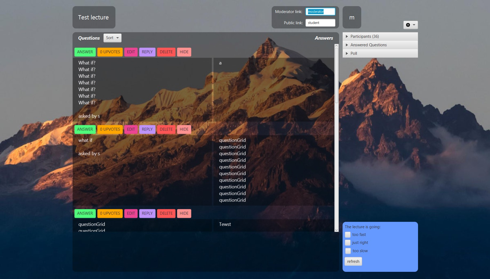
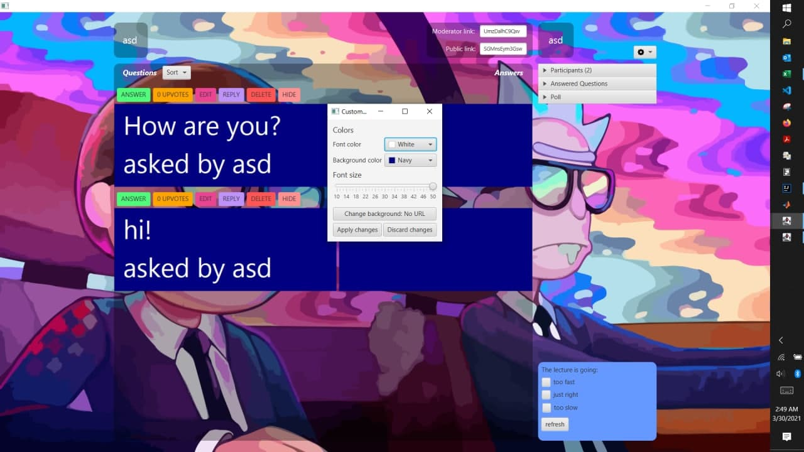

# questi
Springboot application for online lectures. Leave the zoom chat for spam and focus on the most upvoted/hottest/newest questions. Highly customizable GUI.

Students can only ask, sort and vote questions. Moderators can only manage them (sort, edit, reply, hide, delete, or export), and kick/ban users. All users can customize the GUI (font size, colors and background image). All users can start their own Q&A session. 

