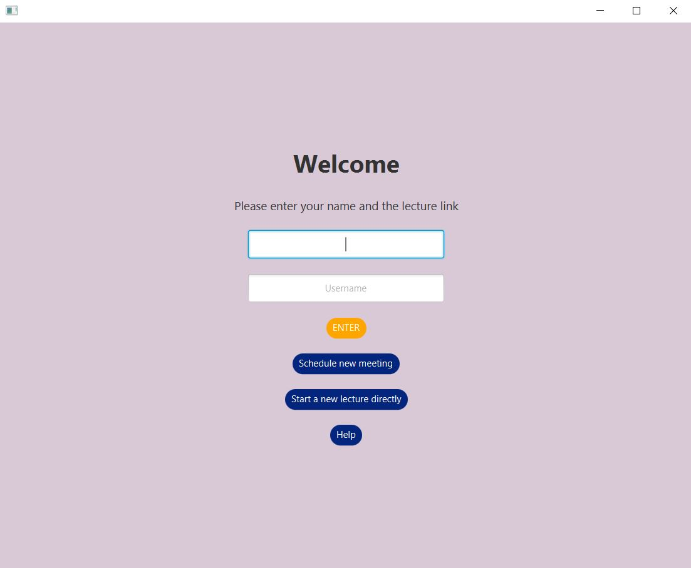

# questi
Springboot application for online lectures. Leave the zoom chat for spam and focus on the most upvoted/hottest/newest questions. Highly customizable GUI.

Students join with the public link and can only ask, sort and vote questions. Moderators join with moderator link and can only manage the already existing questions (sort, edit, reply, hide locally, delete, or export), and kick/ban users. All users can customize the GUI (font size, colors and background image) and all users can start their own Q&A sessions. 

